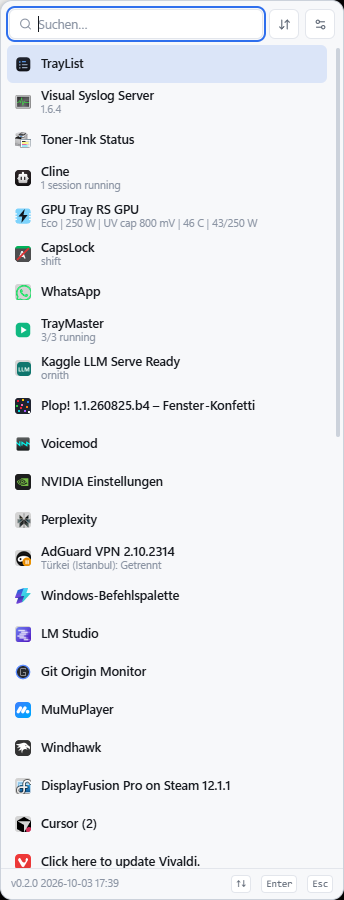
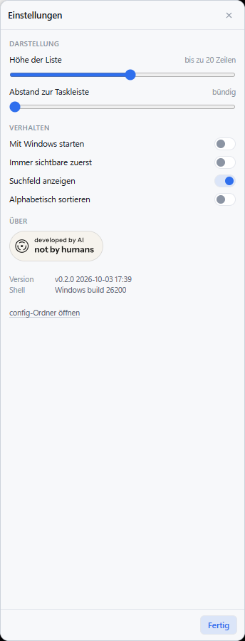

# TrayList

Zeigt die versteckten Windows-Tray-Symbole als **scrollbare Liste mit Namen**
statt als Raster aus Piktogrammen, die man einzeln anfahren muss. Die
englischsprachige Fassung steht in [README.md](README.md).

*[English](README.md) · Deutsch*

Klick auf den Pfeil in der Taskleiste, wie immer. TrayList kennt die Symbole
bereits aus ihrer Registrierung, hält das Windows-Raster zu und zeigt an dieser
Stelle ein eigenes Panel: eine Zeile pro Symbol, links das Piktogramm, rechts
Name und aktueller Zustand, dazu ein Filterfeld für den Fall, dass es vierzig sind.

```
  ▸ du klickst ^ im Tray
  ▸ das Windows-Raster bleibt zu
  ▸ die Liste kommt aus den Registrierungen, die Explorer schon hat
  ▸ Klick oder Hover auf eine Zeile -> die App bekommt dieselbe Nachricht wie von der Shell
  ▸ ein Rechtsklick lässt die Liste stehen, bis daneben geklickt wird
  ▸ Esc / danebenklicken / nochmal der Pfeil -> die Liste geht weg
```

Gebaut als [Tauri v2](https://tauri.app)-App: ein Rust-Kern, der mit der Shell
spricht, und ein React-Panel für die Liste. Eine kleine DLL in Explorer leitet
Hover und Klicks an das Symbol weiter, das sich registriert hat. Keine Erhöhung
der Rechte.



## Was, wer, wann, wie

| | |
|---|---|
| **Was** | Der Windows-11-Tray-Überlauf als benannte und filterbare Liste statt als Raster aus 16×16-Piktogrammen. |
| **Wer** | Geschrieben für einen sehr vollen Tray, mit einem KI-Assistenten als Tippkraft — darum geht es beim Badge unten. |
| **Wann** | Version `0.5.0`. Der Build-Stempel wird beim Kompilieren eingebacken und im Footer des Panels, im Einstellungsdialog und für `trailist-probe theme` angezeigt. |
| **Wie** | Eine kleine DLL in Explorer merkt sich jede `Shell_NotifyIcon`-Registrierung und leitet Hover und Klicks an dieses Fenster weiter. Ein React-Panel zeichnet die Liste. Hängt sich die DLL nicht ein, bleibt der bisherige UI-Automation-Weg, und das Panel sagt das. Die Einstellungen liegen in `config/settings.json` neben der Exe. |

Der Einstellungsdialog, samt Badge und Version:



## Warum es das gibt

Windows 11 versteckt neue Tray-Symbole hinter einem Pfeil und zeigt sie in einem
festen Raster unbeschrifteter 16×16-Piktogramme. Bei ein paar Dutzend Symbolen
heißt das: anfahren, auf den Tooltip warten, raten. Die *Namen* gibt es — es sind
die Tooltips — sie stehen nur nirgends auf einmal. Genau das löst dieses Programm.

## Funktionen

**Die Liste**
- Piktogramm, Name und aktueller Zustand pro Zeile — der Tooltip ist der Name und
  oft der nützlichste Text auf dem Rechner (`GPU: Eco | 250 W | 51 C`,
  `AdGuard VPN — Türkei (Istanbul): Getrennt`, `TrayMaster - 3/3 running`)
- Filterfeld mit Fokus: ein paar Buchstaben tippen, die Liste zieht sich zusammen
- Sortierung: die Reihenfolge der Shell selbst oder alphabetisch
- Tastatur: `↑`/`↓` bewegen, `Enter` öffnet, `Esc` schließt
- Rechtsklick auf eine Zeile öffnet das Kontextmenü des Symbols. Die Liste bleibt
  offen, bis daneben geklickt wird, ein zweiter Rechtsklick heißt also nicht, das
  Panel erneut zu öffnen
- Ein Doppelklick wird als Doppelklick weitergereicht. Der Einfachklick wartet die
  Doppelklick-Zeit des Systems ab, damit ein Symbol, das sich per Doppelklick
  öffnet, und eines, das beim Einfachklick ein Menü zeigt, sich wie im Tray verhalten
- Ein erneuter Start findet die bereits laufende Kopie
- Panel passend zum Inhalt, auf den geklickten Pfeil zentriert und auf der
  Taskleiste aufsitzend, immer innerhalb des Arbeitsbereichs des richtigen Monitors
- Folgt dem Farbschema der Shell: die Palette kommt aus `SystemUsesLightTheme`,
  derselben Einstellung, der Taskleiste und Flyout folgen — das Panel stimmt also
  auch dann mit dem Tray überein, wenn Windows für App-Fenster etwas anderes
  eingestellt hat

**Einstellungen** (das Zahnrad im Panel oder `config/settings.json`)
- Wie hoch die Liste werden darf, bis gut 20 Zeilen ohne Scrollen
- Wie viel Luft zwischen Panel und Taskleiste bleibt, von bündig bis 40 px
- Mit Windows starten, über den Autostart-Eintrag, den Windows selbst liest
- Filterfeld an oder aus, immer sichtbare zuerst, alphabetisch oder Tray-Reihenfolge
- Sprache: `System`, `Deutsch` oder `English`

**Tray-Eigenschaften**
- Pin-Knopf pro Zeile, auch bei Symbolen, die schon in der sichtbaren Leiste
  stehen, damit sich der Pin, der sie dorthin gesetzt hat, wieder ausschalten
  lässt. Geschrieben wird das `IsPromoted`-Flag der Shell
- Symbole, die gerade im Tray sichtbar sind, werden als solche gekennzeichnet
- Ein leerer Tooltip nimmt `InitialTooltip` der Shell, und wenn der auch leer ist,
  die Beschreibung der ausführbaren Datei, damit eine Zeile nicht namenlos bleibt
- Einfarbige Shell-Glyphen wie „Hardware sicher entfernen“ werden in der
  Textfarbe des Flyouts gezeichnet: schwarz auf einem hellen Tray, weiß auf einem
  dunklen. Ein buntes Symbol bleibt, wie es registriert wurde
- Symbole, die sich ständig neu zeichnen, etwa Process Lasso, bleiben sichtbar.
  Der Host kopiert das Piktogramm erst, nachdem Explorer seine eigene Kopie hat

**Hinkommen**
- Klick auf den Pfeil wie gewohnt, oder
- `Alt+Shift+T` von überall, oder
- das Menü des Tray-Symbols

## Voraussetzungen

- Windows 11 (Build 22000 oder neuer). Gebaut ist es gegen den XAML-Tray von
  Windows 11; unter Windows 10 hat das Flyout eine andere Form und die Liste
  findet es nicht.
- WebView2, das mit Windows 11 ausgeliefert wird.

## Loslegen

```powershell
npm install
npm rebuild esbuild   # npm führt esbuilds Postinstall nicht von sich aus aus
npm start             # tauri dev
```

Release-Build (Exe plus NSIS-Installer):

```powershell
.\scripts\build.ps1 -Portable
```

Die portable Exe landet in `dist-app/portable/` und, nach einem Lauf des Skripts,
zusätzlich als `TrayList.exe` im Repo-Wurzelverzeichnis neben `config/`.
`trailist_host.dll` liegt jeweils daneben. Ohne diese DLL fällt das Panel auf
UI Automation zurück.

## Installation

Der NSIS-Installer ist ein Setup für den aktuellen Benutzer und braucht keine
Administratorrechte. Eine vorhandene Installation wird erkannt:

- **0.3 und älter** haben keine Host-DLL. Die laufende App wird beendet und die
  Dateien werden ersetzt. Explorer bleibt an.
- **0.4 und neuer** laden `trailist_host.dll` in Explorer. Die Taskleiste startet
  einmal neu, damit diese Datei ersetzt werden kann; Windows holt die Shell von
  selbst zurück. Dieselbe Pause passiert beim Deinstallieren einer solchen
  Version, sonst bleibt die DLL eingehängt und die Datei lässt sich nicht löschen.

Eine portable Kopie ist `TrayList.exe` mit `trailist_host.dll` im selben Ordner.

## Ohne Oberfläche testen

`trailist-probe` treibt dieselbe Maschinerie von einer Konsole aus, was der
schnellste Weg ist, die Shell-Interaktion nach einem Windows-Update zu prüfen:

```powershell
cargo run --manifest-path .\src-tauri\Cargo.toml --bin trailist-probe -- list
cargo run --manifest-path .\src-tauri\Cargo.toml --bin trailist-probe -- watch
cargo run --manifest-path .\src-tauri\Cargo.toml --bin trailist-probe -- hide
cargo run --manifest-path .\src-tauri\Cargo.toml --bin trailist-probe -- theme
```

`list` gibt aus, was das Panel zeigen würde (und öffnet das Flyout, wenn es
geschlossen ist), `watch` meldet jede Öffnung und wie viele Symbole lesbar waren,
`hide` legt ein herumstehendes Flyout weg, und `theme` gibt das Farbschema aus,
das das Panel verwenden würde — letzteres direkt aus der Registry, damit sich ein
Panel, das falsch aussieht, von einem unterscheiden lässt, das den falschen Wert
gelesen hat.

Mit gesetztem `TRAILIST_DEBUG=1` erzählt die App die Übergabe in
`logs/trailist.log` nach — inklusive, wie lange das Lesen gedauert hat und wie
viele Zellen das gezeichnete Raster hatte — und schreibt jedes Lesen nach
`logs/last-read.txt` (Index, Klickkoordinaten, Symbolgröße und Titel pro Zeile).
Diese beiden Dateien sind der schnellste Weg zu sehen, was die Shell tatsächlich
gemeldet hat.

## Einstellungen

`config/settings.json` neben der Exe (oder `%APPDATA%\TrayList`, wenn dieser
Ordner schreibgeschützt ist). Das Zahnrad im Panel bearbeitet dieselbe Datei; das
Tray-Menü öffnet den Ordner.

| Schlüssel | Standard | Bedeutung |
|---|---|---|
| `panelWidth` | 344 | Breite des Panels in logischen Pixeln. Das native Flyout ist nur ~234 breit, also ist Platz für die Namen. |
| `panelMaxHeight` | 900 | Obergrenze; darüber scrollt die Liste. Absichtlich großzügig: auf einem großen Bildschirm gibt es keinen Grund, eine Liste zu scrollen, die gepasst hätte. |
| `edgeGap` | 0 | Luft zwischen Panel und Taskleiste in logischen Pixeln. `0` setzt das Panel auf die Taskleiste, so wie es das native Flyout tut. |
| `iconSize` | 16 | Symbolgröße in den Zeilen. |
| `sort` | `tray` | `tray` oder `name`. |
| `showSearch` | true | Filterfeld anzeigen. |
| `hotkey` | `Alt+Shift+T` | Globaler Hotkey. `null` schaltet ihn ab. |
| `pinnedFirst` | false | Symbole, die im Tray sichtbar sind, zuerst einsortieren. |
| `lang` | `system` | `de`, `en` oder `system` für die Sprache der Windows-Oberfläche. Alles andere zählt als `system`. |

Der Autostart steht nicht in dieser Datei: er ist ein echter Eintrag unter
`HKCU\Software\Microsoft\Windows\CurrentVersion\Run`, also dort, wo Windows
nachsieht und wo der Autostart-Tab des Task-Managers ihn wieder abschalten kann.

## Wie es arbeitet

```
watcher-Thread
  |
  |- host.rs     trailist_host.dll in Explorer laden und über eine Pipe sprechen
  |              die DLL hängt sich an Shell_TrayWnd, merkt sich NIM_ADD / MODIFY /
  |              DELETE / SETVERSION und kopiert das laufende Symbol
  |- swallow     solange die Pipe verbunden ist, bleibt das Überlauf-Flyout zu
  |- overlay     das Panel, verankert am Pfeil
  |- Klick       die Callback-Nachricht schicken, die das Symbol registriert hat
  |
  '- Ausweich, nur wenn die DLL sich nicht eingehängt hat
       uia.rs + forward.rs    Flyout lesen, verstecken, Klick nachspielen
```

Anwendungen registrieren sich weiter bei Explorer. Die DLL beobachtet diesen
Weg und schickt Zeigerereignisse an dasselbe Fenster zurück, erkannt an der GUID
oder an Fenster und Id. Sie ersetzt nicht die Taskleiste, die Uhr oder die
Symbole, die in der sichtbaren Leiste angeheftet sind.

Auf diesem Rechner kommt die Registrierung als 32-Bit-`NOTIFYICONDATA` in
`WM_COPYDATA` an (`dwData == 1`, Signatur `0x34753423`). Ein Symbol, das nie
`NIM_SETVERSION` gerufen hat, ist Version 0: `wParam` ist die Symbol-Id und
`lParam` die Mausnachricht, ein Rechtsklick also `WM_RBUTTONUP`. Version 4, erst
nach `NIM_SETVERSION`, packt den Punkt in `wParam` und das Ereignis in die
untere Hälfte von `lParam`. Die Version-4-Form an ein Version-0-Fenster schickt
nichts aus.

Der Name ist der laufende Tooltip. Ist der leer, nimmt die Zeile
`InitialTooltip` aus `HKCU\Control Panel\NotifyIconSettings`, und ist der auch
leer, die Dateibeschreibung der ausführbaren Datei. Eine Registrierung, deren
Fenster schon weg ist, fällt raus. Explorer macht dasselbe, wenn ein Prozess
ohne `NIM_DELETE` endet.

Das Piktogramm wird erst gelesen, nachdem Explorer seine eigene Kopie hat. Die
Bitmap des Aufrufers vorher zu lesen hat Symbole geleert, die sich bei jedem
Update selbst ersetzen. Ein 32-Bit-Symbol, das das Alpha-Byte auf null lässt,
nimmt seine Form aus der Maske. Eine Glyphe, die nur eine einzige Farbe ist,
wird danach auf die Textfarbe der Shell gefärbt. Deshalb stimmt „Hardware sicher
entfernen“ mit dem Flyout überein und bleibt nicht die weiße Form, die die
Taskleiste registriert hat.

Der bisherige Weg liegt noch im Baum. UI Automation liest
`TopLevelWindowForOverflowXamlIsland`, und `forward.rs` spielt einen Klick mit
`SendInput` nach. Das Panel kennzeichnet diese Liste als Notbehelf. Der
Windows-10-Weg über `ToolbarWindow32` ist nicht umgesetzt.

## Bekannte Grenzen

- **Der Pfeil öffnet diese Liste.** Hover und Klicks gehen an die Registrierung
  (GUID oder Fenster und Id), nicht an ein Pixel im Windows-Raster. Das Raster
  bleibt zu, solange der Host hängt.
- **Der UI-Automation-Weg ist nur der Ausweich**, wenn die DLL sich nicht einhängen
  konnte. Das Panel kennzeichnet diese Liste. Das ist das alte Verhalten: das
  Raster kann aufblitzen, und Hover kommt nicht an.
- **Eine Zeile, deren laufendes Piktogramm noch fehlt,** nutzt weiter den
  PNG-Schnappschuss unter `HKCU\Control Panel\NotifyIconSettings`.
- **Der Tooltip ist der Name.** Was darin steht, entscheiden die Anwendungen, also
  lesen sich ein paar Zeilen wie ein Status statt wie ein Name. Ein leerer Tooltip
  fällt auf `InitialTooltip` zurück, danach auf die Beschreibung der ausführbaren
  Datei. Wo eine Anwendung ihren eigenen Namen zweimal schreibt —
  `TrayMaster TrayMaster - 3/3 running` — wird die Wiederholung entfernt, weil nur
  die Wiederholung dort falsch ist.
- **Ein Update von 0.4 oder neuer startet Explorer einmal neu.** Die Host-DLL hängt
  in diesem Prozess, und die Datei lässt sich erst ersetzen, wenn der Prozess weg
  ist. Die Taskleiste blinkt und kommt zurück. Ein Update von 0.3 braucht das nicht.
- **Kein Vordergrund, keine Tastatur.** Das Panel erscheint, weil du auf die
  *Taskleiste* geklickt hast, also darf Windows uns den Vordergrund verweigern.
  TrayList besteht zweimal darauf; scheitert das, funktioniert die Liste weiterhin
  mit der Maus.
- **Eine versteckte Taskleiste versteckt den Pfeil.** Mit Auto-Hide ist der Pfeil
  nicht im Baum, solange die Taskleiste unten ist, `Alt+Shift+T` hat dann nichts zum
  Auslösen und meldet, dass es ihn nicht gefunden hat. Der Klick auf den Pfeil ist
  nicht betroffen, weil genau der die Taskleiste erst hochholt.
- **Fehlermeldungen sprechen zwei Sprachen.** Der Satz kommt aus dem Panel, also in
  der eingestellten Sprache; was Windows im Detail dazu sagt, wird unverändert
  angehängt — es ist Windows' eigene Formulierung in Windows' eigener Sprache.

## Aufbau

```
src/                     React-Panel (die Liste und der Einstellungsdialog)
src/lib/i18n.ts          die deutschen und englischen Texte des Panels
src-tauri/src/
  watcher.rs             die Zustandsmaschine: Host-Liste, oder der Flyout-Ausweich
  overlay.rs             Geometrie und Platzierung des Panels
  commands.rs            die IPC-Oberfläche
  settings.rs            config/settings.json
  types.rs               was über die Brücke geht, und wie aus einem Tooltip eine Zeile wird
  i18n.rs                Sprachauswahl und die Texte des Tray-Menüs
  version.rs             die Versionszeile, die das Panel zeigt
  win/host.rs            lädt trailist_host.dll und spricht mit ihr
  win/forward.rs         Klicks nachspielen, nur wenn der Host nicht hängt
  win/uia.rs             das Flyout auf diesem Ausweich lesen
  win/island.rs          das Überlauf-Flyout-Fenster
  win/capture.rs         die Symbol-Bitmaps
  win/registry.rs        NotifyIconSettings, IsPromoted
  win/glyph.rs           färbt eine einfarbige Shell-Glyphe auf die Textfarbe des Flyouts
  win/theme.rs           welches Farbschema die Shell zeichnet
  win/autostart.rs       der Run-Eintrag des Benutzers
  win/launch.rs          einen Link im Browser öffnen
  win/focus.rs           den Vordergrund holen
  bin/probe.rs           Konsolen-Oberfläche zum Testen
src-tauri/host/          die DLL, die Explorer lädt; sie spiegelt Shell_NotifyIcon
src-tauri/windows/       NSIS-Hooks: 0.3 vor Ort ersetzen, ab 0.4 Explorer neu starten
src-tauri/build.rs       stempelt den Build mit der lokalen Zeit des Compiler-Rechners
public/badges/           das not-by-humans-Badge, eines pro Panel-Theme
scripts/build.ps1        Release-Build
scripts/make-icons.ps1   erzeugt den Symbolsatz
docs/PLAN.md             die Planung und die Entscheidungen, auf Deutsch
docs/PLAN.en.md          dieselbe Planung auf Englisch
docs/screenshot-*.png    die Bilder oben, ein Paar pro Sprache
```

## Tests

```powershell
cargo test --manifest-path .\src-tauri\Cargo.toml
```

Das App-Crate prüft das Stück mit echtem Raten: aus den Tooltips, die der Tray
dieses Rechners tatsächlich produziert, einen Namen und einen Zustand zu machen.
Jeder Fall darin kommt von einem echten Tray, auch die unangenehmen — der Name auf
einer Zeile wiederholt, über zwei Zeilen wiederholt, ein Name, der nur ein Wort
teilt, und ein Tooltip, der nichts als der zweimalige Name ist. Weitere Tests
prüfen die Sprachauswahl (eine Einstellung gilt vor der Systemsprache, und jede
Sprache hat ein vollständiges Tray-Menü) und dass eine weiße Glyphe für eine helle
Shell umgefärbt wird.

Das Host-Crate prüft das 32-Bit-`NOTIFYICONDATA`-Layout, das dieser Build wirklich
schickt, einschließlich einer `Shell_NotifyIconGetRect`-Anfrage, und dass ein
Symbol ohne Alpha seine Form aus der Maske nimmt:
`cargo test --manifest-path .\src-tauri\host\Cargo.toml`.

## Dank

Das Badge ist von [not by humans](https://notbyhumans.fyi) — *developed by AI, not
by humans*. Tinte auf einem dunklen Panel, Papier auf einem hellen; die Kopien in
`public/badges` sind die Dateien, die die Seite ausliefert, und ein Klick auf das
Badge führt zurück zu der Seite, die es erklärt.

<a href="https://notbyhumans.fyi"></a>

