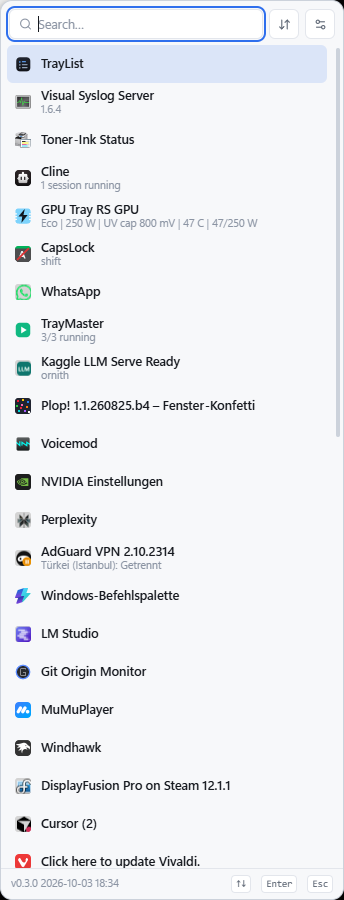
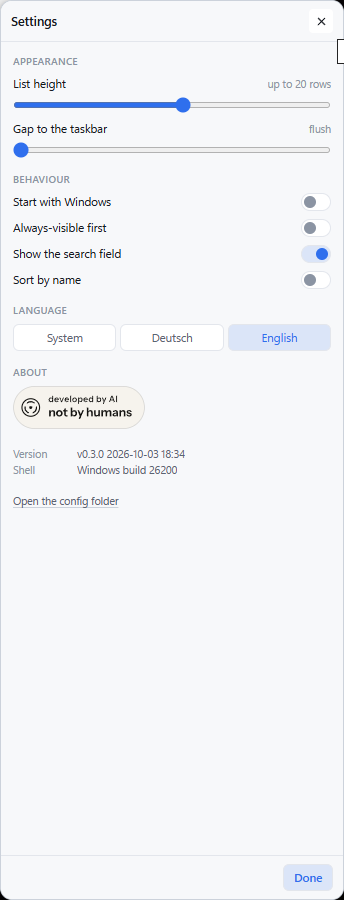

# TrayList

Shows the hidden Windows tray icons as a **scrollable list with names** instead
of an icon grid you have to recognise by sight.

Click the tray chevron as you always have. TrayList reads the flyout that
Windows just opened, puts it away, and shows its own panel in the same corner:
one row per icon, icon on the left, name and current state on the right, and a
filter box for when there are forty of them.

*English · [Deutsch](README.de.md)*

```
  ▸ you click ^ in the tray
  ▸ TrayList reads the icons and their tooltips, and grabs their bitmaps
  ▸ the Windows grid is hidden and the list appears where it was
  ▸ click a row  -> the app's own menu opens, exactly as before
  ▸ Esc / click away / the chevron again -> the list goes away
```

Built as a [Tauri v2](https://tauri.app) app: a Rust core that talks to the shell
and a React panel for the list. No injection, no shell hooks, no elevation.



## What, who, when, how

| | |
|---|---|
| **What** | The Windows 11 tray overflow, as a named and filterable list instead of a grid of 16x16 glyphs. |
| **Who** | Written for one very full tray, with an AI assistant doing the typing — which is what the badge at the bottom is about. |
| **When** | Version `0.3.0`. The build stamp is baked in at compile time and shown in the panel's footer, in the settings dialog, and to `trailist-probe theme`. |
| **How** | A Rust core reads the shell's own flyout through UI Automation and takes its place; a React panel draws the list. Settings live in `config/settings.json` next to the exe. |

The settings dialog, including where the badge and the version live:



## Why this exists

Windows 11 hides new tray icons behind a chevron and shows them in a fixed grid
of unlabelled 16x16 glyphs. With a few dozen icons that means hovering, waiting
for tooltips, and guessing. The icon *names* exist — they are the tooltips — they
just are not shown anywhere at once. That is the whole problem this solves.

## Features

**The list**
- Icon, name and current state per row — the tooltip is the name, and it is
  often the most useful text on the machine (`GPU: Eco | 250 W | 51 C`,
  `AdGuard VPN — Türkei (Istanbul): Getrennt`, `TrayMaster - 3/3 running`)
- Filter box, auto-focused: type a few letters, the list narrows as you type
- Sorting: the shell's own order, or alphabetical
- Keyboard: `↑`/`↓` to move, `Enter` to open, `Esc` to close
- Right-click a row for the icon's own context menu
- Panel sized to the content, centred on the chevron that was clicked and resting
  on the taskbar, always inside the work area of the right monitor
- Follows the shell's colour scheme: the palette is chosen from
  `SystemUsesLightTheme`, the same setting the taskbar and the flyout follow, so
  the panel matches the tray it replaces even when Windows is set to a different
  scheme for app windows

**Settings** (the gear in the panel, or `config/settings.json`)
- How tall the list may get, up to 20-odd rows without scrolling
- How much air to leave between the panel and the taskbar, from flush to 40 px
- Start with Windows, via the per-user autostart entry Windows itself reads
- Filter box on or off, always-visible icons first, alphabetical or tray order
- Language: `system`, `de` or `en`. The panel, the tray menu and the error messages
  all follow it; anything that is not German gets English rather than a mixture

**Tray attributes**
- Optional pin button per row: turns an icon on or off in the *visible* part of
  the tray by writing the shell's own `IsPromoted` flag
- Icons that are currently visible in the tray are marked as such

**Getting to it**
- The normal chevron click, or
- `Alt+Shift+T` from anywhere, or
- the tray icon's menu

## Requirements

- Windows 11 (build 22000+). It is built against Windows 11's XAML tray; on
  Windows 10 the flyout has a different shape and the list will not find it.
- WebView2, which ships with Windows 11.

## Getting started

```powershell
npm install
npm rebuild esbuild   # npm does not run esbuild's postinstall by default
npm start             # tauri dev
```

Release build (exe plus NSIS installer):

```powershell
.\scripts\build.ps1 -Portable
```

The portable exe lands in `dist-app/portable/` and, when the script has run,
also as `TrayList.exe` in the repo root next to `config/`.

## Testing without the UI

`trailist-probe` drives the same machinery from a console, which is the fastest
way to check the shell interaction after a Windows update:

```powershell
cargo run --manifest-path .\src-tauri\Cargo.toml --bin trailist-probe -- list
cargo run --manifest-path .\src-tauri\Cargo.toml --bin trailist-probe -- watch
cargo run --manifest-path .\src-tauri\Cargo.toml --bin trailist-probe -- hide
cargo run --manifest-path .\src-tauri\Cargo.toml --bin trailist-probe -- theme
```

`list` prints what the panel would show (and opens the flyout if it is closed),
`watch` reports every opening and how many icons were readable, `hide` puts a
stray flyout away, and `theme` prints the colour scheme the panel would use —
that last one straight from the registry, so a panel that looks wrong can be told
apart from a panel that read the wrong value.

With `TRAILIST_DEBUG=1` set, the app narrates the handover in
`logs/trailist.log` — including how long the read took and how many cells the
drawn grid was found to have — and writes every read to `logs/last-read.txt`
(index, click coordinates, icon size and title per row). Those two files are the
quickest way to see what the shell actually reported.

## Settings

`config/settings.json` next to the exe (or `%APPDATA%\TrayList` when that folder
is read-only). The gear in the panel edits the same file; the tray menu opens the
folder.

| Key | Default | Meaning |
|---|---|---|
| `panelWidth` | 344 | Panel width in logical pixels. The native flyout is only ~234, so there is room for the names. |
| `panelMaxHeight` | 900 | Upper bound; the list scrolls past it. Generous on purpose: on a large screen there is no reason to scroll a list that would have fitted. |
| `edgeGap` | 0 | Breathing room between the panel and the taskbar in logical pixels. `0` rests the panel on the taskbar the way the native flyout does. |
| `iconSize` | 16 | Icon size in the rows. |
| `sort` | `tray` | `tray` or `name`. |
| `showSearch` | true | Show the filter box. |
| `hotkey` | `Alt+Shift+T` | Global hotkey. Set `null` to disable. |
| `pinnedFirst` | false | Sort icons that are visible in the tray first. |
| `lang` | `system` | `de`, `en`, or `system` for the language Windows' own interface is in. Anything else counts as `system`. |

Starting with Windows is not in this file: it is a real
`HKCU\Software\Microsoft\Windows\CurrentVersion\Run` entry, which is where
Windows looks and where Task Manager's startup tab can switch it off again.

## How it works

```
watcher thread (owns UI Automation and every shell interaction)
  |
  |- island.rs   find the flyout window     TopLevelWindowForOverflowXamlIsland
  |- uia.rs      read the icons             Buttons with AutomationId=NotifyItemIcon,
  |                                         whose Name is the full tooltip
  |- capture.rs  render the bitmaps         PrintWindow(PW_RENDERFULLCONTENT) of the
  |                                         flyout, then key its background out
  |- suppress    ShowWindow(island, SW_HIDE)  the grid goes away, explorer state intact
  |- overlay     our panel, sized to the flyout's own rectangle
  |- forward.rs  replay a click             SW_SHOWNOACTIVATE, SendInput, SW_HIDE again
```

The classic Windows 10 route into the tray -- a `ToolbarWindow32` inside
`TrayNotifyWnd`, read with `TB_GETBUTTON` and `TRAYDATA` -- is gone. On Windows 11
the notification area is a XAML island, and on recent Windows 11 builds even the
`SystemTray` implementation classes have moved out of `Taskbar.View.dll`. UI
Automation is the interface that survived, and the icons' tooltips come with it.

Details worth knowing, because they are what makes this feel native:

- The flyout is hidden with `SW_HIDE` rather than told to close. Explorer keeps
  its own state, so the next chevron click opens the flyout exactly as before
  instead of landing on a half-closed window.
- A replayed click briefly shows the flyout *without activating it*, so the click
  lands on the icon rather than being absorbed by a focus change.
- The bitmaps come from the shell first: `HKCU\Control Panel\NotifyIconSettings`
  stores a PNG snapshot of each icon together with its first tooltip, and rows are
  matched to those by tooltip so the icon is the real one, alpha and all. Only
  icons without a snapshot are cut out of a `PrintWindow(PW_RENDERFULLCONTENT)`
  rendering of the flyout, keyed against its background.
- Nothing is trusted about where an icon *is* except the drawing itself. UI
  Automation reports rectangles that can still be moving while the flyout
  animates — a rectangle half a cell off crops a square of background with the
  icon pushed to the bottom of it. So the grid of cells is measured from the
  rendering: project "not the background colour" onto both axes and cut the
  result into evenly spaced bands. That is also what makes the list order come
  from the shell's own listing rather than from those wobbling rectangles.
- The panel takes the foreground with `SetForegroundWindow`, twice: Windows often
  refuses the first call when the click that opened the panel went to the taskbar,
  and an auto-hide taskbar sliding away can hand the foreground back again.

## Known trade-offs

- **The native grid is on screen for about 60 ms.** UI Automation only sees the
  icons while their window is on screen, so the handover cannot start before the
  shell opens the flyout. Everything after that is hidden: the flyout is moved off
  screen the moment it is found, and read and rendered while it is parked there.
  Total time from the click to the list is about half a second, most of which is
  waiting for the shell to finish laying the icons out.
- **A click needs the flyout back for about 300 ms.** The shell only routes an
  icon's click while that icon is on screen, so a replayed click briefly puts the
  flyout back underneath. The panel is hidden first, which is why the app's own
  menu appears without our window swallowing the click.
- **Icons are the shell's own, so a brand-new one may not have one yet.** Windows
  keeps a PNG snapshot of every tray icon under
  `HKCU\Control Panel\NotifyIconSettings`; an icon the shell has not stored yet
  falls back to a cell cut out of a rendering of the flyout, keyed against that
  flyout's background.
- **Hover tooltips are not replayed.** Moving the pointer over a row does not
  make the owning app show its hover text, because that is not a click.
- **The tooltip is the name.** Applications decide what goes in it, so a few rows
  read as a status rather than a name. Where an application writes its own name
  twice — `TrayMaster TrayMaster - 3/3 running` — the repeat is removed, because
  only the repeat is wrong there.
- **No foreground, no keyboard.** The panel appears because you clicked the
  *taskbar*, so Windows may refuse to hand us the foreground. TrayList insists
  twice; if that ever fails, the list still works with the mouse.
- **A hidden taskbar hides the chevron.** With auto-hide on, the chevron is gone
  from the tree until the taskbar is up, so `Alt+Shift+T` has nothing to invoke
  and reports that it could not find it. Clicking the chevron is unaffected,
  because that is what reveals the taskbar in the first place.
- **Error messages are bilingual in one line each.** The sentence itself is written
  by the panel, so it is in the language that is set; what Windows said about the
  failure is appended unchanged, because it is Windows' own wording in Windows' own
  language. Only the two languages exist, and everything that is not German gets
  English.

## Layout

```
src/                     React panel (the list and the settings dialog)
src/lib/i18n.ts          the panel's German and English strings
src-tauri/src/
  watcher.rs             the state machine: detect, read, hide, show, dismiss
  overlay.rs             panel geometry and placement
  commands.rs            IPC surface
  settings.rs            config/settings.json
  types.rs               what crosses the bridge, and how a tooltip becomes a row
  i18n.rs                the language setting, and the tray menu's own strings
  version.rs             the version label the panel shows
  win/island.rs          the overflow flyout window
  win/uia.rs             reading the icons
  win/capture.rs         icon bitmaps
  win/forward.rs         replaying clicks
  win/registry.rs        NotifyIconSettings, IsPromoted
  win/theme.rs           which colour scheme the shell is drawing in
  win/autostart.rs       the per-user Run entry
  win/launch.rs          opening a link in the browser
  win/focus.rs           taking the foreground
  bin/probe.rs           console front end for testing
src-tauri/build.rs       stamps the build with the compiler host's local time
public/badges/           the not-by-humans badge, one per panel theme
scripts/build.ps1        release build
scripts/make-icons.ps1   generates the icon set
docs/PLAN.md             what this is, why it is built this way, what is next
docs/screenshot-*.png    the pictures above, one pair per language
```

## Tests

```powershell
cargo test --manifest-path .\src-tauri\Cargo.toml
```

Three tests. The first is on the piece with real guesswork in it: turning the
tooltips this machine's tray actually produces into a name and a state. Every
case in it came off a real tray, including the awkward ones — the name repeated
on one line, the name repeated across two, a name that merely shares a word, and
a tooltip that is nothing but the name twice.

Two more cover the language setting: that the setting wins over the system's
language, and that every language has a complete tray menu. The frontend's own
strings are checked by the compiler rather than by a test — the tables are one
object each, so `tsc` is what catches a key that no longer exists.

## Credit

The badge is [not by humans](https://notbyhumans.fyi) — *developed by AI, not by
humans*. Ink on a dark panel, paper on a light one; the copies in `public/badges`
are the files the site serves, and clicking the badge goes back to the site that
explains it.

<a href="https://notbyhumans.fyi"></a>
